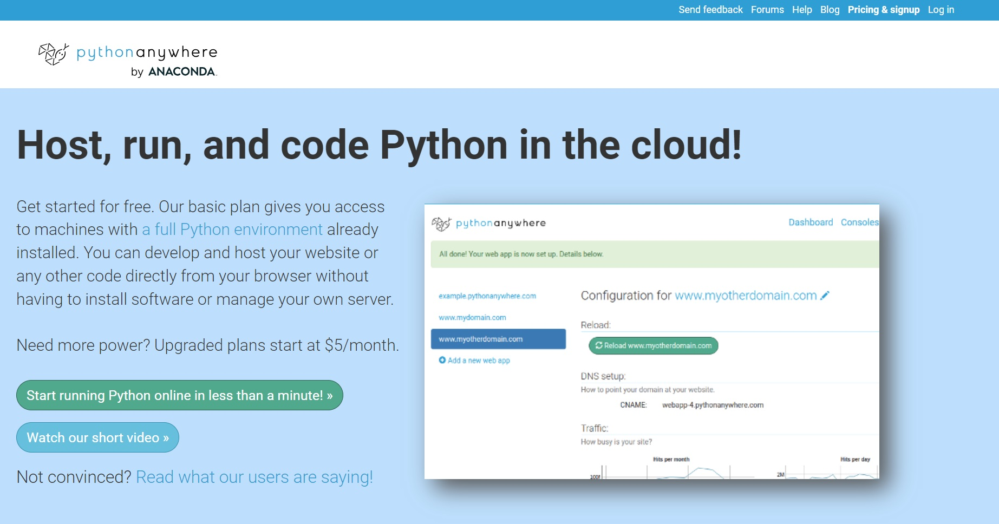

# <a href='https://www.pythonanywhere.com/'> pythonanywhere</a> 서버로 활용.

- 계정당 1개의 파이썬 무료서버 이용가능.

  

<br>
<br>

# https://readyone.pythonanywhere.com/

<br>
<br>

# task

- 로컬환경과 서버에서 개발을 원활하기 위해 setting 분리. <a href="https://wikidocs.net/75560">참고 사이트</a>
  - 현재환경에서 사용할 세팅설정
    ```cmd
    rem 윈도우 커멘드 명령어
    set DJANGO_SETTINGS_MODULE=web.local
    ```

---

- melon 크롤링을 위한 app 생성.
  - 장고 앱생성하기.
    ```cmd
    rem 윈도우 커맨드 명령어
    django-admin startapp melon
    ```
